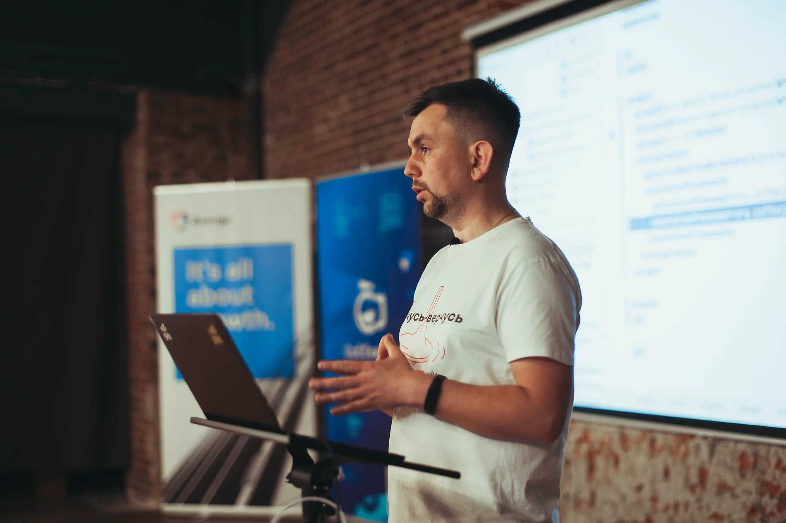

# resume

## My Articles

### Preparing a Great Technical Presentation
TODO: add description

[Medium](https://medium.com/@jappware/on-preparing-a-great-technical-presentation-25dd3a7fa468)

[Company Site](https://www.jappware.com/insights/preparing-a-great-technical-presentation/)

### Protecting your IT system: Choosing a Right MFA Solution
TODO: add description

[Medium](https://medium.com/@ivan.verhun/protecting-your-it-system-choosing-a-right-mfa-solution-74e0f04c54df)

[Company Site](https://www.jappware.com/insights/protecting-your-it-system-choosing-a-right-mfa-solution/)

### Passwordless Authentication
[[Medium] Passwordless Authentication with WebAuthn](https://medium.com/@jappware/passwordless-authentication-with-webauthn-4bfe7c34ee95)

[[Company Site] Intro to Passwordless Authentication](https://www.jappware.com/insights/intro-to-passwordless-authentication/)

### Infrastructure as a Code (IaaC)
[[Medium] AWS CloudFormation for Newbies](https://medium.com/@jappware/aws-cloud-formation-for-newbies-cc215e90dea9)

[[Company Site] Infrastructure as a code or CloudFormation for newbie](https://www.jappware.com/insights/infrastructure-as-a-code-or-cloud-formation-for-newbie/)

## My Contribution into Local Tech Community 

### Morning@Lohika
TODO: add description

### Lviv JvavClub
TODO: add description

## My Video
TODO: add description

https://www.jappware.com/insights/bringing-value-in-partnership/

### Lviv JavaClub 
Up-to-date playlist : https://www.youtube.com/@lvivjavaclub/search?query=verhun

1. [![Lviv JavaClub [Event 153] ✨ Compile-time annotation processing](https://img.youtube.com/vi/5ZSrnrmdN5Q/0.jpg)](https://www.youtube.com/watch?v=5ZSrnrmdN5Q)
1. [![Lviv JavaClub [Event 229] Tools overview](https://img.youtube.com/vi/yPnzq3QbNzc/0.jpg)](https://www.youtube.com/watch?v=yPnzq3QbNzc)
1. [![Lviv JavaClub [Event 205] Git internals](https://img.youtube.com/vi/Xk5hH79dCBU/0.jpg)](https://www.youtube.com/watch?v=Xk5hH79dCBU)
1. [![Lviv JavaClub [Event 281] 3D printing - a toy or an irreplaceable tool](https://img.youtube.com/vi/e9qlwZt_H4g/0.jpg)](https://www.youtube.com/watch?v=e9qlwZt_H4g)

### CoffeeJUG

[Compile-time annotation processing in Java](https://www.coffeejug.org/copy-of-coffeejug-with-ivan-verhun)
Every Java developer knows about the power of annotations and libraries like Lombok. However not everyone understands how this "magic" works, and how can we leverage it besides using third-party libraries. This talk reveals the back-stage of compile-time annotation processing.

### Morning@Lohika

# Hobbies

## 3D Printing

* Creality CR-10s PRO

## Arduino and similar microcontrollers

* Arduino
* ESP32
* NodeMCU